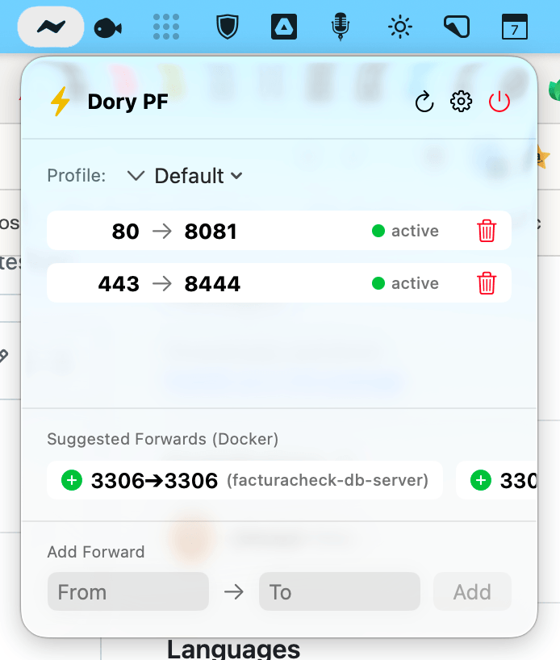

# Dory Port Forwarder (Dory PF) ⚡

<p align="center">
  
</p>

<p align="center">
  
</p>


**Dory Port Forwarder (Dory PF)** is a lightweight, native macOS menu bar application developed in Swift and SwiftUI. It simplifies port forwarding and redirection in macOS environments (highly useful for local development with **Dory**, Docker, or OrbStack) while maintaining **0% idle CPU usage**.

It redirects low ports (`80`, `443`, ...) to your local services using a small **user-space TCP proxy** that runs entirely in your own user account — **no root, no admin password, no system-level changes.**

---

## ✨ Features

*   **⚡ Optimized Performance (Hybrid Model):** The app only performs checks and consumes resources when the menu bar window is open. Once closed, it halts entirely (0% idle CPU usage).
*   **🐳 Automatic Docker (Dory) Integration:** Automatically detects running containers via a direct low-level connection to `/Users/USER/.dory/dory.sock` and suggests port redirections in 1 click.
*   **⚠️ Smart Conflict Detection:** Alerts you if the entry port is held by some other process (not the Dory proxy), showing you the occupying process name (e.g., `httpd`, `Ollama`, etc.) in a detailed tooltip.
*   **🟢 Live Target Status:** Visual indicators show in real-time whether the target port (e.g., your Docker container) is active and listening for connections.
*   **📁 Profile Management:** Create, select, and organize your rule sets into different profiles (e.g., Development, Staging, Testing).
*   **🔒 Zero-Privilege Installation:** Installing and uninstalling the proxy never asks for an administrator password — it's a normal per-user LaunchAgent.
*   **📦 100% Native & Dependency-Free:** No Node.js, Electron, or third-party libraries.

---

## 🛠️ Architecture & How It Works

*   **The GUI (Swift/SwiftUI):** Reads and writes port forwarding rules to a plain text file in your user directory: `~/.dory/port-forwards.conf`.
*   **The proxy engine (`dory-pf-proxy`):** A small Swift binary, bundled inside the app (`DoryPortForwarder.app/Contents/MacOS/dory-pf-proxy`), run as a per-user LaunchAgent (`~/Library/LaunchAgents/local.dory-pf-proxy.plist`). For every configured rule it opens a **wildcard, dual-stack TCP listener** on the entry port and relays bytes to `127.0.0.1:<target>`.
*   Since macOS Mojave, a **non-root process can bind a TCP port below 1024 as long as it binds the wildcard address** (`0.0.0.0` / `::`). Binding a specific interface address on a low port still requires root — this app never needs that, because it only ever listens on the wildcard address and relays to `127.0.0.1`. This is the same technique Docker Desktop / OrbStack use for the same problem.
*   **Loopback-only peers:** because a wildcard bind is technically reachable from the LAN too, every accepted connection is checked against the peer address; anything that isn't `127.0.0.1`, `::1`, or `::ffff:127.0.0.1` is closed immediately, before any data is read. Backends only ever listen on `127.0.0.1`, so this is a second, independent layer of protection.
*   **Hot reload:** the proxy watches `~/.dory/port-forwards.conf` and applies rule changes (open/close listeners) within about a second, without dropping already-established connections for rules that didn't change.

### Why not PF (Packet Filter) anymore?

Earlier versions of this app used a root LaunchDaemon that injected `rdr` (redirect) rules into the macOS kernel Packet Filter, in a dedicated anchor (`com.dory.rdr`). That approach turned out to be fundamentally incompatible with any setup that also uses `InternetSharing`-based NAT (this is what Apple's Container Runtime / Dory's vmnet networking uses for containers, visible as the `bridge100` interface):

1.  `InternetSharing` periodically **replaces the entire PF main ruleset**, and the ruleset it installs sets a global `skip on lo0` option.
2.  `skip on lo0` disables **all** PF processing on loopback traffic — including `rdr` translation. The redirect rules stayed loaded (`pfctl -a com.dory.rdr -s nat` showed them) but silently stopped matching anything (`Packets: 0`).
3.  Reloading `/etc/pf.conf` to clear the skip flag revived the redirect, but also dropped `InternetSharing`'s own dynamically-attached NAT anchors, cutting off container internet access — which caused `InternetSharing` to reload and re-apply `skip on lo0` again. There is no stable PF configuration against a system daemon that rewrites the main ruleset at will.

The fix was to stop using PF entirely and move to a user-space proxy, which is immune to this because it doesn't touch the kernel packet filter at all.

---

## 📥 Installation

### Requirements
*   macOS 13.0 (Ventura) or newer (Mojave's low-port-without-root behavior is present on all supported versions).
*   Dory, Docker Desktop, or OrbStack installed and running.

### Option A: Using Pre-built Releases (ZIP)
1. Download **`DoryPortForwarder.zip`** from the latest GitHub Release and extract it.
2. Drag the extracted **`Dory Port Forwarder.app`** to your `/Applications` folder.
3. Open your terminal and run the following command to remove the macOS quarantine flag (Gatekeeper):
   ```bash
   xattr -r -d com.apple.quarantine /Applications/Dory\ Port\ Forwarder.app
   ```

### Option B: Build and Package from Source
To build your native `.app` bundle (GUI + proxy binary) with its custom icon automatically, clone the repository and run the build script:

```bash
chmod +x build.sh
./build.sh
```

This generates **`DoryPortForwarder.app`** in the root directory, containing both `DoryPortForwarder` (the menu bar app) and `dory-pf-proxy` (the proxy engine). You can drag it to your `/Applications` folder and add it to your macOS login items if desired.

---

## 🚀 Usage

1.  **Initial Setup (Onboarding):** On first launch, if the proxy isn't installed yet, click **Install Proxy**. This writes a LaunchAgent to `~/Library/LaunchAgents` and starts it immediately — **no password prompt.**
2.  **Adding Rules:**
    *   **Manual:** Input the entry port (e.g., `80`) and the target port (e.g., `8081`) and click **Add**. The proxy picks up the change automatically within ~1s.
    *   **Docker suggestions:** If you have running containers with public port mappings, they will appear under **Suggested Forwards (Docker)**. Just click the `[+]` button to add them instantly.
3.  **Handling Conflicts:** If you see a red triangle `⚠️`, hover over it — it means another process (not the Dory proxy) is holding that entry port, so the forward can't work until that's resolved.
4.  **Profiles:** Use the dropdown menu at the top to switch between forwarding environments in seconds.
5.  **Settings:** Shows proxy status (installed/running), a **Restart Proxy** button (rarely needed — the proxy already hot-reloads on config changes), and **Uninstall**.
6.  **Legacy migration:** If a leftover install of the old root/PF daemon is detected on your Mac, Settings shows a **Clean Up Legacy Install** button. This is the only action in the app that still asks for an admin password — it removes the old LaunchDaemon, its helper script, and the PF anchor/wiring lines (keeping a backup of `/etc/pf.conf`). It does not touch the live PF ruleset, so it won't disturb other software's rules or your container networking.

---

## 🩺 Diagnostics

*   **Proxy log:** `~/Library/Logs/dory-pf-proxy.log` — startup, rules loaded, listener open/close, reload events, and rate-limited warnings about rejected non-loopback connection attempts.
*   **LaunchAgent status:**
    ```bash
    launchctl print gui/$(id -u)/local.dory-pf-proxy
    ```
*   **Manual restart:**
    ```bash
    launchctl kickstart -k gui/$(id -u)/local.dory-pf-proxy
    ```
*   **Quick connectivity check:**
    ```bash
    curl -4kIsL http://127.0.0.1/
    curl -4kIsL https://127.0.0.1/
    curl -6kIsL http://[::1]/
    ```

---

## 📄 License

This project is licensed under the MIT License - see the [LICENSE](LICENSE) file for details.

---

## 🤝 Contributing

Suggestions, bug reports, and pull requests are welcome! Feel free to open an issue or submit a PR if you want to extend socket paths or add integrations.
